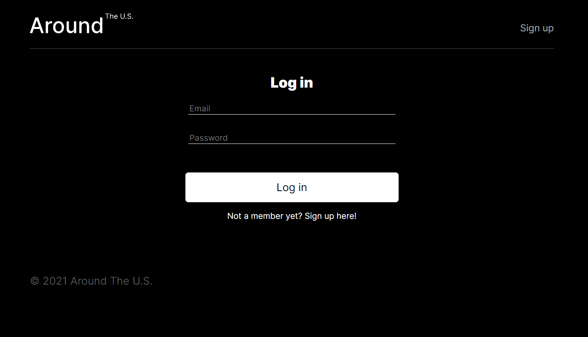
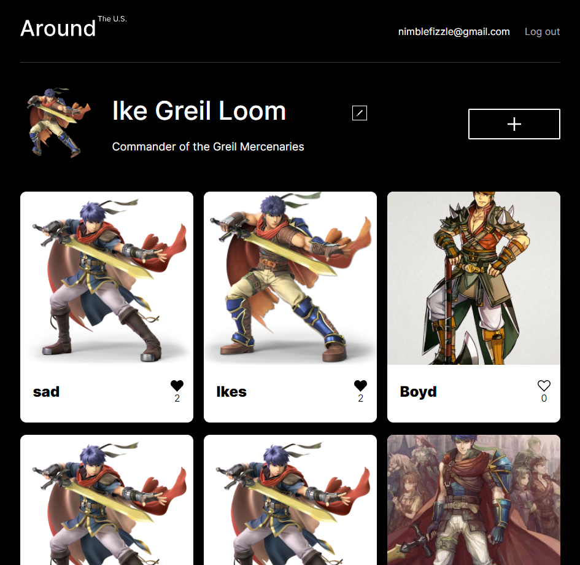
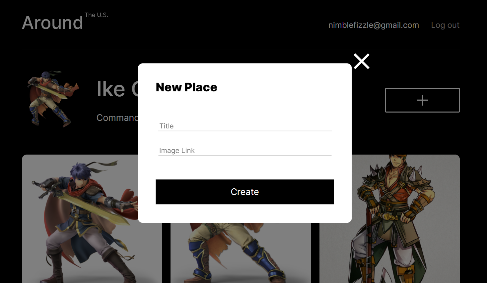
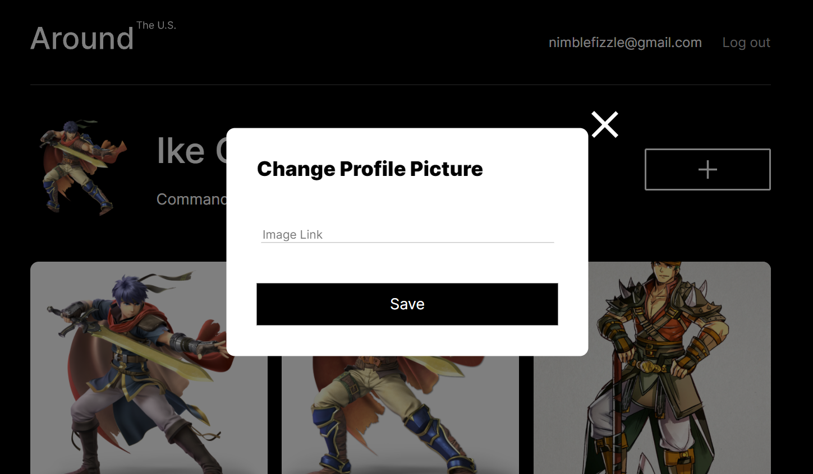
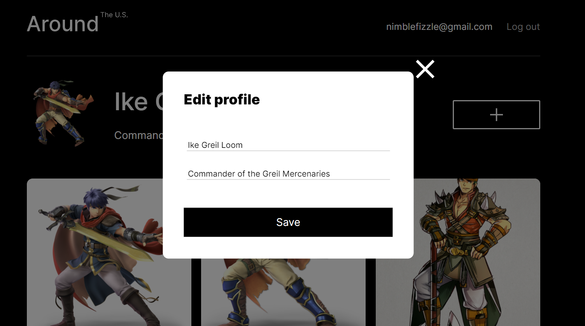

# Around the U.S.

### Intro

Around the U.S. project on React, featuring authorization and registration.

This repository contains my front-end project on React with added authorization and registration features.
All authorization, registration and token requests go through to my RESTful api: https://github.com/Kethiannne/react-around-api-full

### Functionality

  - The main purpose of this project was to learn about authorization and authentication technologies with React, while the main purpose of the website itself is to allow users to     post images on a public forum and to respond with likes to eachother's images.
  - User data is stored on the API, while a JWT sent to the user's local storage authenticates them on subsequent visits.
  - Clicking an image will move it into a modal for a more detailed view.
  - Clicking the heart button on a given card will either add or remove your user info from the list of those who like the image, updating the number of likes and the heart's         visuals accordingly.
  - Users can edit their information through clicking on their profile image or the edit button near their profile name.
  - Users can add cards to the page with an add button, only the owner of a card can then delete it.

### Technologies
  - React JS
  - React Router DOM
  - Hosting via Google Cloud

### Live Version

https://kethianne-around.students.nomoreparties.site

### Future Improvements
  - Smoother integration of cards so a refresh is not needed before deletion
  - card like button fix: prevent like button from re-rendering thw whole card to not reset the state of the card as a whole

### images

